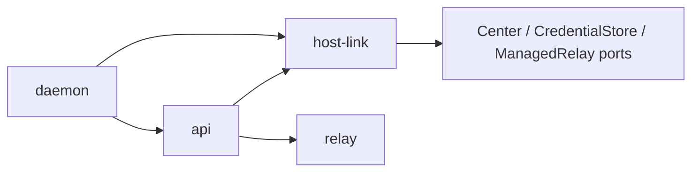

# Linux 无人值守设备授权

本方案已在 AIT daemon 分支实现，中心配套为
[ait-server PR #9](https://github.com/ait-app/ait-server/pull/9)。上线仍需要合并两端、开启中心功能，
并让既有安装脚本以同一系统账号和数据目录启动 `daemon run --headless`。
长期边界见 [ADR-087](../decisions/clients/adr-087-headless-device-authorization.md)，
实际操作见 [无人值守 daemon](../operations/headless-daemon.md)。

## 身份与两种管理方式

两种方式使用相同的 `hosts → nodes → node_sessions`，不新增第二套机器身份或独立 devices 页面。
网页的 Host 页面负责查看在线情况、签发接入 token 和撤销授权。

| 事项                 | 原客户端管理模式                    | 无人值守管理模式                                |
| -------------------- | ----------------------------------- | ----------------------------------------------- |
| 长期授权持有者       | 桌面/移动客户端的账户管理器         | Rust daemon 的私有凭据存储                      |
| 注册、租约、控制票据 | 客户端用用户 JWT 管理               | daemon 用机器 JWT 管理                          |
| 运行会话来源         | `password_session` / `oidc_session` | `device_grant_id`                               |
| 长期授权记录         | 原用户认证会话                      | `node_grants`；绑定 owner、Host、node 和 server |
| 客户端退出           | 保持既有平台管理器的租约规则        | 不影响机器授权；daemon 自己续期                 |
| Relay 控制权         | 本地鉴权客户端发送 start/stop       | 内部管理器独占，客户端只读状态                  |
| 撤销入口             | 原账户/单台同步操作                 | 网页 Host 授权撤销或 `daemon logout`            |

稳定身份沿用 `server-id`，`installation_id = server_id`；`instance_id` 每次启动变化。
名字只是显示标签。中心批准 Web 请求时允许显式选已有 Host；接入 token 绑定特定 Host。
一个稳定 node 同时只能有一个有效运行会话，不能通过改名字或重新启动绕过冲突。

## 授权与固定中心

唯一生产中心为 `https://dash.ait-app.com:8443/api`，没有 CLI、环境变量或配置文件覆盖。
HTTP 禁止重定向，Web 验证地址必须等于 `https://dash.ait-app.com:8443/auth/device`。
传输层不解码 token 中的地址，也不接受中心响应指定另一 authority。
本地测试通过仅在测试构建中存在的 adapter 注入模拟中心。

```sh
daemon login --name build-linux
daemon login --token '<一次性接入 JWT>' --name build-linux
daemon login --token-stdin --name build-linux
daemon run --headless
daemon status --json
daemon logout
```

安装、systemd、启停和卸载由既有脚本负责，没有服务安装子命令。
登录可以在另一台设备的浏览器完成，daemon 不需要桌面或回调监听端口。
提供 token 与 stdin 互斥，空值、格式错误和兑换失败均终止，不回退到 Web 授权。
网页继续使用现有 OIDC 登录用户，机器凭据由中心后端签发。

| 凭据                 | 用途                               | 有效期与保存                                           |
| -------------------- | ---------------------------------- | ------------------------------------------------------ |
| 一次性接入 JWT       | 将本机绑定到指定 Host              | 15 分钟；只用于 enroll                                 |
| Web 私有 device code | 轮询领取授权                       | 10 分钟；保存于私有 pending 状态，终端只显示 user code |
| 机器 access JWT      | 注册自身、续租、控制票据、释放会话 | 最长 15 分钟；只存内存                                 |
| opaque refresh token | 轮换机器凭据、撤销自身 grant       | 最后刷新后 30 天，受账号截止时间约束；私有 `.env`      |

机器 JWT 的 `aud=ait-daemon`、`typ=ait-device+jwt`、`sub=node:<node_id>`、
`scope=host:publish relay:control`。它不能发现其他 Host、管理账号或作为远程客户端连接。
用户网页登录退出或 OIDC 自然到期不撤销机器 grant；禁用、删除、账号安全事件和显式撤销会失效。

## 已实现的中心契约

以下路径相对于固定 `/api`，请求为 JSON。`machine` 包含稳定 UUID `server_id`、
`display_name`、`platform=linux` 和 `app_version`。

| 路径                                           | 请求 / 结果                                                                                                         |
| ---------------------------------------------- | ------------------------------------------------------------------------------------------------------------------- |
| `POST /v1/auth/device/authorize`               | `{client_id:"ait-linux-daemon",machine}`；返回 device code、user code、固定验证 URL、600 秒期限和至少 5 秒 interval |
| `POST /v1/auth/device/preview`                 | 用户 JWT + `{user_code}`；展示机器声明                                                                              |
| `POST /v1/auth/device/approve`                 | 用户 JWT + `{user_code,host_id?}`；批准绑定                                                                         |
| `POST /v1/auth/device/deny`                    | 用户 JWT + `{user_code}`；拒绝                                                                                      |
| `POST /v1/auth/device/token`                   | `{device_code,request_id}`；批准后领取机器凭据                                                                      |
| `POST /v1/hosts/{host}/enrollment`             | 用户 JWT；签发 15 分钟的一次性接入 token                                                                            |
| `DELETE /v1/hosts/{host}/enrollment`           | 用户 JWT；取消未消费 token                                                                                          |
| `POST /v1/auth/device/enroll`                  | `{token,request_id,machine}`；兑换机器凭据                                                                          |
| `POST /v1/auth/device/refresh`                 | `{refresh_token,request_id}`；轮换                                                                                  |
| `POST /v1/auth/device/revoke`                  | `{refresh_token}`；撤销自身 grant                                                                                   |
| `GET /v1/hosts/{host}/device-authorization`    | 用户 JWT；查看非秘密授权状态                                                                                        |
| `DELETE /v1/hosts/{host}/device-authorization` | 用户 JWT；撤销 Host 授权及未消费审批                                                                                |

领取/兑换/刷新返回相同字段：`token_type=Bearer`、`access_token`、`expires_in`、
`access_expires_at`、`refresh_token`、`refresh_expires_at`、`node_id`、`host_id`、
`server_id`、`grant_id`。daemon 检查稳定 ID 和刷新后的完整 binding，不能扩大或改变目标。
回执返回原始绝对到期时间，不能把旧 `expires_in=900` 重置成新的寿命。

Web 轮询错误是原有 envelope `{"error":{"code":"…","message":"…"}}`。
`authorization_pending` 保持 interval；`slow_down` 增加 5 秒；网络/429/5xx 退避，
不延长原始截止。`access_denied` / `expired_token` 终止。

运行协议复用：

- `/v1/nodes/register`：有 runtime，发送同一安装 ID、当前 instance UUID 和 `ait-rust-single-v1`。
- `/v1/node-sessions/{id}/renew`：约 20 秒续租一次，租约约 60 秒；用新 JWT 推进授权截止。
- `/v1/node-sessions/{id}/control-tickets`：取得 30 秒一次性控制票据。
- `DELETE /v1/node-sessions/{id}`：停止当前运行，保留 grant。

中心新增的表只承载授权：`node_grants`、`device_authorizations`、`device_enrollments`、
`node_refresh_tokens`、`device_token_receipts` 和 `device_rate_limits`。
`node_sessions.device_grant_id` 关联授权来源；users/hosts 的 `device_epoch` 使旧审批和 token 失效。
原 `host_credentials` 保留兼容，不自动升级。迁移和事务实现由 ait-server PR #9 管理。

## Rust 边界与运行生命周期



`host-link` 不依赖 workspace 其他 crate，只协调串行刷新、注册、租约和重连。
`daemon::device` 实现固定 HTTP 和原子存储 adapter，组装 `Controller`。
`api` 实现 `ManagedRelay` port，启动前发出唯一内部 handle。
`relay` 仍是叶子传输模块，只接收一次性票据，不持有 refresh token。

headless API 的外部 HTTP start/stop 返回 409；RPC 返回 `relay_managed`。
`relay.status` 返回 `management.mode=managed` 和非秘密阶段/binding。
共享客户端识别该模式后只读状态，不注册、不续租、不停止机器会话。
旧 daemon 的省略 management 字段按原客户端管理路径处理。

启动后先刷新，从已保存 grant 注册当前 instance。控制断线时取新票据，指数退避最长 30 秒。
网络故障可能导致注册/续租已提交但响应丢失，因此保留 registration ID / session ID 重试；
只有中心明确 `node_session_expired` / `registration_expired` 才重新注册。
本地 JWT 或租约截止时关闭 Relay，包含正在等待 HTTP 的情况。
运行冲突每 30 秒重试、等待旧实例租约释放；撤销/协议/持久化错误终止远程管理，保留本地 daemon 服务与任务供诊断。
信号或本地生命周期请求停止 Relay，尝试释放节点会话，不撤销机器 grant。

## 原子持久化与恢复

`<data-dir>/device` 为 `0700`，`device/.env` 为 `0600`；拒绝秘密文件和锁文件 symlink，
拒绝可被其他用户读取的凭据。`.env` 只保存一个 base64 JSON snapshot 变量；base64 是
序列化格式，不是加密。现有本地 `AIT_SERVER_TOKEN` 仍通过受保护环境配置，不能混用机器 JWT。
进程持有实例锁和独立 credential OS 锁，login/logout 需要先停止同目录的服务。
status 不取 credential 锁，读取非秘密缓存快照及其时间，不宣称缓存是即时在线证明。

每次消费 Web code、接入 JWT 或 refresh token 之前，先保存原秘密和随机 request UUID。
写临时文件 → 文件 fsync → 原子 rename → 父目录 fsync 后，才能发出消费请求。
收到新凭据后用同样方式保存完整下一代 snapshot，包含清空 pending，再在内存采用新凭据。
任何无法确认持久化的失败都停止轮换，不能继续消费后继 token。

中心允许相同秘密 + 相同 request ID 在 10 分钟内恢复同一结果，不产生第二次轮换。
刷新用不同 request ID 重放、或超过恢复窗口会撤销 grant；客户端不能靠改 ID 解决恢复失败。
Web/接入 token 请求还受原始过期时间约束。恢复窗口结束且新凭据没有落盘时必须重新授权。
新的 `daemon login` 可以继续未完成的 Web/enrollment 请求；刷新 pending 由 headless 启动恢复。
`logout` 先尝试中心 revoke 再清本地；离线或未完成的初次领取可能留下未知 grant，CLI 提示网页撤销。

## 后续发布验收

- 合并并启用中心功能，配置独立签名及回执密钥。
- 既有脚本安装的新二进制，以同一用户/数据目录运行 headless；无需新增 service install。
- 在真实固定中心完成 Web 授权和网页接入 JWT 两种登录，包含跨设备浏览器登录。
- systemd 重启、网络断开/恢复、超过 JWT 寿命的长时间运行和网页撤销。
- 在安装目标 filesystem 验证 fsync、权限和崩溃恢复；本地测试不替代真实机器故障演练。
- 不自动批准 Provider 权限，不创建 GUI 自动化宿主，不改变本地 API 默认 loopback 与 token 鉴权。

## Test coverage

提交前在 Linux / Rust 1.98.1、默认 features、完整 workspace 上运行
`cargo llvm-cov --locked --workspace --html -- --test-threads=8`（未额外排除文件）。测量源码是 `3b42a810`
加本 PR 的 Rust 变更，最终提交与共享 HTML artifact 链接记录在 PR 的 Test coverage 中。

- Workspace 行覆盖率 94.44%（50322 / 53286）；`host-link` 94.27%（181 / 192）。
- `daemon` 93.21%（1605 / 1722），`api` 93.32%（2038 / 2184），`model` 94.86%（738 / 778）。
- 测试执行：1833 通过，3 个需要已安装 Claude/Codex 与真实 Provider 认证的既有测试忽略。
- 没有可比基线，不声称覆盖率增幅。覆盖率不是测试通过率，也不代表所有错误分支覆盖。
- 未覆盖主要是信号/错误处理与部分状态 adapter 路径；真实生产中心、systemd、断电和目标
  filesystem 的故障恢复验收仍待两端部署。macOS/Windows 的 headless 行为不在本轮验收范围。

CI 的 `rust-coverage` artifact 上传 HTML；对应最终提交的下载链接记录在 PR 中，供 review。
