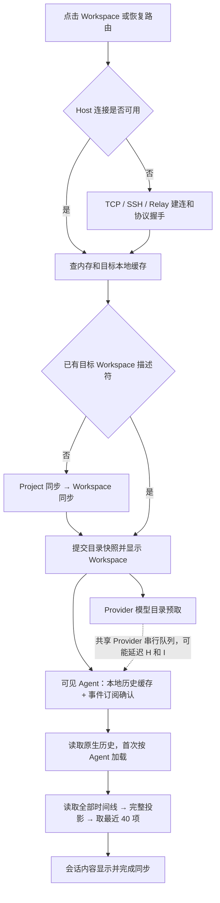

# 远程 Workspace 打开性能优化方案

状态：会话与 Provider 并发隔离已实施；目标目录加载、历史分页与远程耗时验收待后续推进。日期：2026-10-06。
分析基线：`5df233ac2f87cecda5f1a1ee99c003a15522dc49`。

## 结论与范围

优先处理三个问题：Provider 后台发现与首屏读取共用串行队列、长会话每次取页都读取并投影全部历史、目标 Workspace 的打开依赖整台主机的目录同步。远程网络会放大这些等待，单独减少 React 渲染或增加缓存时长不足以解决它们。

本方案基于当前源码调用链审查，没有采集用户实际远程连接的时间瀑布。因此下文的执行行为是已确认事实，耗时占比和优化收益需要第一阶段测量；不能据此断言某一阶段在所有场景都最慢。

主要范围是已有 Workspace 的侧栏打开、路由恢复与跨 Workspace 切换，覆盖 TCP、SSH 和账户 Relay。需要另外标记两类操作：

- 从 Open Project 按目录打开会调用 `workspace.open.request`，可能检查目录、恢复或创建记录；它不同于已有 ID 的路由打开。
- 新建 worktree、检出 PR、安装依赖与 setup 脚本包含独立的业务等待，不计入已有 Workspace 首屏基准。

本文件的调用链分析保留改造前基线；当前并发执行路径见 [ADR-091](../decisions/providers/adr-091-independent-session-execution.md) 与[验证报告](../reports/providers/paseo-concurrency-validation.md)。

## 改造前打开路径

Agent 目录与 Project/Workspace 目录会并行刷新，不是所有数据都串行下载。图中展示的是目标路径的依赖；缓存已有 Workspace 时，路由并不强制等待全目录刷新。Git 标题、终端、文件与 Diff 面板各自还有独立的加载状态。

### 1. Provider 后台工作会挡住首屏读取

已确认行为：

- [WorkspaceScreen](../../apps/mobile/src/screens/workspace/workspace-screen.tsx) 在路由聚焦、连接可用时调用 `prefetchProvidersSnapshot`。
- [模型缓存](../../crates/provider/src/service/provider_catalog.rs) 以目录区分 scope，最多保留 16 个 scope，60 秒后视为过期。未命中或过期时，循环逐个 `await discover` 已注册的 Provider。
- [AgentExecution](../../crates/provider/src/service/agent_execution.rs) 通过一个容量 64 的命令队列处理请求，worker 完成当前请求后再接下一个。模型发现、Agent 目录、事件订阅里的 Agent 查询、原生历史加载与时间线查询会进入这个执行器。
- [请求入口](../../crates/provider/src/rpc/agent_execution.rs) 在业务处理前还会 poll 原生会话并派发待发送输入。

所以前端的“后台预取”虽然不直接 `await` 在路由上，仍可能先占用服务端执行器。某个 Provider 的启动、探测或模型读取慢，后来的会话读取就排队。已经运行的长任务无法仅靠调整队列顺序被抢占。

推断：这很可能解释“偶尔慢”，尤其是首次进入某个目录、缓存过期、同时创建/恢复 Agent 或远端 Provider 状态不佳时。需要测量请求入队与实际开始时间，确认是不是这条链路。

### 2. 首次查看 Agent 要加载原生历史

[load_timeline](../../crates/provider/src/service/agent_manager.rs) 在每个 daemon 进程中对每个 Agent 首次访问时调用 Provider 的 `history`，之后 reconcile 到本地时间线。它使用进程内 `loaded_timelines` 标记，daemon 重启会重新走这一步。

Codex 的 [history 适配](../../crates/provider/src/local/codex/discovery.rs) 最终调用 [inspect_native](../../crates/provider/src/local/codex/native_sessions.rs)：启动 transport、initialize、`thread/read(includeTurns: true)`、转换历史并关闭 transport。因此远端 daemon 的原生程序启动和整段历史读取也在首次会话显示路径上。

这是历史检查，不等价于每次打开 Workspace 都恢复一个交互式 Agent。当前事件订阅验证 Agent 身份，也不能直接当作启动原生 writer 的证据。

### 3. 只显示 40 项，服务端仍处理全部历史

客户端 [首屏策略](../../apps/mobile/src/timeline/timeline-fetch-policy.ts) 是 40 个投影后的展示项。服务端实际流程是：

1. [timeline RPC](../../crates/provider/src/rpc/agent_execution.rs) 调用 `timeline.read(agent)`。
2. [存储读取](../../crates/provider/src/storage/timeline/progress.rs) 查询该 Agent 的 entries 和 progress，按 seq 排序，没有页级 `LIMIT`，解析全部 JSON。
3. [投影分页](../../crates/provider/src/rpc/timeline/projection/page.rs) 先 `project(rows)`，合并工具生命周期和相邻文本，再截取 tail/before/after。

所以 `limit: 40` 限制返回数量，没有限制服务端读取和投影成本。长会话冷开、再次取页、断线补齐都会重复支付这部分成本。查询还会持有共享时间线数据库锁；实际对流式写入的影响需要测量。

不能直接把 SQL 改成取最后 40 条原始事件：一个展示项可能覆盖很多文本片段，工具开始和结束也可能相距很远。必须保留 `sourceSeqRanges`、连续覆盖、epoch、gap 和 reset 语义。

### 4. 目标打开依赖主机目录，全量同步的 200 条限制并未生效

[DirectorySync](../../apps/mobile/src/runtime/directory-sync/index.ts) 有目标 ID 的本地缓存读取，但没有对应的目标 Workspace 远程读取。缓存没有目标时，Project 与 Workspace 是先后请求，Workspace 快照事务完成后才提交。

客户端会传 `page.limit: 200`，但当前 [Workspace listing](../../crates/metadata/src/rpc/directory/listing.rs) 与 [Agent listing](../../crates/provider/src/rpc/agent_runtime/listing.rs) 在 `sync` 分支返回完整快照或全部变更，`hasMore: false`，不执行普通分页。因此当前支持目录同步的 Rust daemon 首次连接仍会传整份目录；不能把客户端常量视为响应规模上限。

而且 [DirectorySync 服务端](../../crates/model/src/directory_sync.rs) 的同步是“调用方构造完整投影 → replace_all 比较 → 返回变更”，增量传输并不等于增量计算。每次重新构造 Workspace 快照还会读取所有活动记录、聚合活动状态、获取各目录的 runtime 缓存。

前端 `refreshAll` 还会先等 [本地整目录恢复](../../apps/mobile/src/runtime/replica-cache/index.ts)，逐条解析和校验缓存。这可能增加冷启动 CPU 成本，应与目标 ID 缓存恢复分别测量。

### 5. 连接建立有不同的成本

| 方式       | 已确认行为                                                                                                                                                                          | 主要优化机会                                                             |
| ---------- | ----------------------------------------------------------------------------------------------------------------------------------------------------------------------------------- | ------------------------------------------------------------------------ |
| TCP        | [Rust transport](../../apps/mobile/src/runtime/rust-daemon/transport.ts) 创建 4 条物理 WebSocket；全部 open 后才发 hello，全部收到 server_info 后才 ready                           | 测每条连接，减少首次依赖的物理连接或按需建立                             |
| 浏览器 TCP | 每条 WebSocket 前有一次 [一次性票据交换](../../apps/mobile/src/runtime/rust-daemon/browser-transport.ts)                                                                            | 减少物理连接可以同时减少票据交换                                         |
| SSH        | 同样 4 条 WebSocket；[桌面 transport](../../apps/desktop/src/daemon/local-transport.ts) 为每条连接创建 proxy 并启动 `ssh` 子进程                                                    | 共享 SSH 隧道或采用协商后的单连接；底层是否已复用 SSH 会话取决于用户配置 |
| Relay      | [账户连接](../../apps/mobile/src/runtime/rust-daemon/connection.ts) 已使用 1 条物理连接；[openVisit](../../packages/client/src/account-session.ts) → WSS → relay.ready → Rust hello | 分段测量票据、配对、hello；保持已选 Host 的可用连接                      |

4 条连接是并行建立，成本接近最慢一条加握手屏障，不能直接算成 4 倍 RTT。Relay 已经是单连接，减少 4 条连接的方案不会改善它。

已有 Workspace 切换通常复用 HostRuntime 连接；[探测逻辑](../../apps/mobile/src/runtime/host-runtime.ts) 也会将第一个可用的 probe client 直接升级为活动连接，不必等所有候选探测完成。优化时保留这些已有行为，先证实有没有多余重连。

10 秒 Rust 握手、15 秒 SDK 默认连接、45 秒 Relay setup 等数字是超时上限，不是每次正常打开必须等待的时间。失败重试和退避应单列为长尾原因。

### 6. 已有优化与局部等待

- [Workspace runtime](../../crates/filesystem/src/local/workspace_runtime.rs) 已将 Git/Forge 命令放到后台缓存，Git 与 Forge 分别限流；不要把目录列表描述为同步等待所有 GitHub 请求。目录 canonicalize 和完整投影仍有本地成本。
- [文件 registry](../../crates/file/src/registry.rs) 首次加载后保留内存记录，不能假设每次 list 都重新读 JSON 文件。
- [客户端缓存](../../apps/mobile/src/runtime/replica-cache/index.ts) 已保存目录和最近最多 50 个时间线展示项；[ViewedTimelineSync](../../apps/mobile/src/timeline/viewed-timeline-sync.ts) 已优先补齐可见 Agent，并在普通恢复溢出时退回最新 tail。优化应扩展这些机制。
- [Workspace 保留](../../apps/mobile/src/screens/workspace/workspace-deck-retention.ts) 在桌面/Web 最多 10 个、闲置 TTL 10 分钟，原生端最多 1 个。移动端切换会更频繁重新挂载，但数据缓存与 UI 挂载需要分开测。
- [标题栏](../../apps/mobile/src/screens/workspace/use-workspace-checkout-status.ts) 会额外读取 checkout status；[header 派生](../../apps/mobile/src/screens/workspace/workspace-screen.tsx) 在其 pending 时显示 loading。它是局部等待，不能与整页、会话等待合并归因。

## 分阶段实施

### P0：建立可以归因的打开瀑布

给一次用户打开生成 `openAttemptId`，与现有 RPC request ID、client generation、connection epoch 关联。使用各进程的单调时钟统计各自耗时，通过关联 ID 对齐，避免直接相减设备间时间戳。

记录以下阶段：

| 阶段                           | 必要字段                                                                                       |
| ------------------------------ | ---------------------------------------------------------------------------------------------- |
| 用户点击 → 路由提交 → 首次绘制 | Workspace/Agent 的匿名关联 ID、设备、入口、缓存命中、是否复用连接                              |
| 连接                           | connection type、每条 WS open/hello、SSH setup、Relay ticket/pairing、重试原因与次数           |
| 本地缓存                       | 目标读取与整目录读取分别计时，行数、字节数、解析和 store 提交时间                              |
| RPC                            | 方法、发送/接收、返回字节数、重试次数；服务端 admission、queue wait、execution、serialize 分开 |
| Provider                       | 按 provider/scope 的 discover、native launch/init/history、reconcile 耗时                      |
| 时间线                         | 原始事件数、投影项数、返回项数，DB 等锁/读/解析、投影、前端 merge/paint 耗时                   |

已有 [SDK runtime metrics](../../packages/client/src/daemon-client-runtime-metrics.ts) 统计入站字节与 handler 时长，但不是打开级瀑布，且 `connectionPath` 当前固定为 direct。复用它的计数机制，补足请求耗时和实际连接类型；结合现有 native trace、RenderProfile 与 workspace profiling 脚本。

定义三个不同的终点：

- `T_shell`：目标 Workspace 的标题、tab、布局与本地草稿首次绘制，缓存可用时允许展示并标明连接状态。
- `T_content`：当前选中的 Agent 有可读内容，或当前终端已有首帧；缓存内容单独标明尚未同步。
- `T_ready`：目标已经权威确认，可见 Agent 的订阅与历史同步完成，相关交互满足当前已有可用性条件。

首屏、可读和可交互分别统计，不能通过提前移除 spinner 把真实慢隐藏起来。埋点不保存 token、ticket、prompt、历史正文或原始目录路径；诊断日志有界并按需启用。

### P1：先解除后台工作对可见会话的阻塞

第一步是低成本改动：

1. Workspace 打开时先确保目标描述符、可见 Agent 事件订阅和首屏 tail；模型目录预取推迟到可见内容完成后。draft/model selector 打开时仍可主动请求。
2. 使用上次模型快照立即呈现，更新状态由现有 Provider 推送补齐；确认切换 scope 时不把其他目录的能力当成当前目录的权威配置。
3. 标题先显示 Workspace 已知名称，checkout 分支和 Git 状态独立刷新，避免标题区域长时间空白。

这能减少由当前打开新触发的队列竞争，但不能解决其他窗口或已有长任务占用执行器。因此第二步是服务端隔离：

- Provider catalog discovery 改为有界后台工作，按 scope/provider 去重，允许返回缓存和逐项 loading 状态；发现失败只影响相应 Provider。
- 纯目录/历史查询使用读取投影或快照，不强制排在原生创建、resume、send、发现之后。交互式 writer 的生命周期与写入顺序由所属 Agent 的单一所有者协调，不同 Agent 可以并发。
- 不简单扩大当前队列或把同一个 `&mut AgentManager` 并发执行。后台任务通过明确的 port/结果提交进入所有者，长历史导入按 Agent 去重并限制并发。

具体入口、状态所有权、Paseo 参考代码和回归条件见[Paseo 并发模型对齐修改清单](paseo-agent-concurrency.md)。

预期收益主要在偶发长尾；以 `provider.queue_wait`、慢 Provider 与并发创建的场景验证。

### P1：已有持久化历史先可读，再校验原生历史

对于持久化时间线已有内容的 Agent，首屏先返回已有 canonical tail，原生检查移到后台；返回明确的 freshness/reconciliation 状态，完成后推送更新。空时间线或首次导入仍要等原生历史，不能伪造完整历史。

原生程序可能在 Ait 外发生变化，因此已有持久化历史只是可立即阅读的快照；不能据此直接认为权威同步已完成。处理 replacement/rewind、epoch 变化、工具更新和客户端未确认消息时继续使用现有替换与去重规则。

这一项与执行器隔离配合实施，否则“后台校验”仍可能占住唯一队列，拖慢下一次打开。

### P2：用目标 ID 打开，主机目录后台同步

新增只读的目标 Bootstrap 能力，建议请求携带 `workspaceId`，响应只包含目标 Workspace、所属 Project 与有界 Agent 摘要，并提供目标状态及同步版本。具体方法名在协议设计时确定。

- 不复用当前 `workspace.open.request`：它按 cwd 打开并可能恢复/创建记录，不适合路由只读查询。
- 也不使用现有 `idPrefix` 作为精确查询：当前协议明确它是兼容字段，不执行过滤。
- Agent 摘要必须分页或限定首屏范围，不能把拥有很多 Agent 的单 Workspace 变成另一个全量请求。
- timeline tail、模型、Git/PR、terminal snapshot 不放进轻量 Bootstrap 的阻塞响应；分别在所需面板加载。
- 目标缓存存在时先显示；目标缓存缺失时优先这个小请求，整台主机目录与侧栏后续补齐。
- 目标不存在、归档、恢复中与 daemon 重启有明确状态；快照和后续事件用一致的 generation/seq 规则衔接，旧响应不能覆盖新事件，也不能因侧栏尚未加载就判 missing。

若需要组合 metadata 与 provider，由 `api` 协调所属能力的读取 port；数据和协议投影仍归各能力所有，不让 metadata 依赖 provider。实施时为这项长期边界变化补 ADR 并更新架构索引。

短期可以尝试并行获取 Project 和 Workspace，然后在同一事务提交，减少一轮请求依赖；需要先验证返回数据依赖与物理连接的串行处理。它仍不能消除等待整份目录的问题。

### P2：时间线分页真正限制计算量

采用分两步落地的方案：

1. 为每个 Agent 缓存版本化展示投影。版本包含 epoch 和实际内容修订号；progress 的 finalize/replacement 可能改变已有 seq 的内容，不能只按最高 seq 判断缓存有效。首次完整构建后增量维护，先消除重复全投影。
2. 在 provider 所属存储建立可分页的展示投影/index，按展示位置与 source coverage 查 tail/before/after，只读取当前页和必要依赖。canonical 原始事件保留，投影是可重建的派生数据。

单纯的进程内缓存仍要重启后全建一次；第二步才解决长会话冷启动。需明确迁移、版本失效、内存预算和恢复方式。已有原始事件+完整投影可作为正确性对照与回退。

回归重点：跨页工具生命周期、文本合并、非连续 source range、运行中工具完成、before/after 覆盖边界、rewind/replacement、过期 epoch、并发流事件与待确认输入。比较新旧投影结果，不只验证“返回 40 条”。

### P3：目录与订阅成本随变更量增长

- 区分完整侧栏基线、目标读取和按版本增量。大主机完整基线有真正分页与字节预算，分批响应先可显示；完整基线结束前不标记全局 hydrated 或保存完整 checkpoint。
- 分页快照固定 generation/head，后续事件先缓冲或按规则合并，删除只在完整基线完成时权威处理，不能把未下载的 Workspace 当作删除。
- 当前变更推送已存在；在所属能力维护共享目录投影，按 registry/runtime mutation 更新并生成有界变更日志，减少每个订阅者重复构造全目录。
- 可见 Agent 的订阅确认与首屏 tail 可设计成一次有界 bootstrap，保留原子订阅/快照衔接；尾页不能排在所有历史 tab 身份逐个查询之后。没有可靠事件屏障时，保留现有先订阅后 fetch 顺序。

### P3：按连接方式优化握手

- TCP/SSH 优先评估复用现有 `connection.single.v1` 协商机制；也可只建首屏所需连接，再按需启用其他能力连接。保留旧 daemon 回退。
- SSH 如保留多物理 WS，则主进程持有可复用、引用计数的隧道。认证、关闭、重连和多窗口所有权要清晰；不能因共享而泄露 Bearer token。
- Relay 已有单物理连接和 [四条有界能力 worker](../../crates/api/src/connection/single.rs)，先优化实际慢的 ticket/pairing/业务执行。保持单连接中的公平输出、队列预算与文件/终端流隔离。
- 优先保持当前选中 Host 的可用连接。移动端后台暂停符合现有生命周期要求，回前台通过轻量探活恢复；不为所有账户主机常驻新建连接。

传输改造不是第一步：它只影响需要建连的打开，解决不了在线切换时的 Provider 排队或长历史投影。

## 测量矩阵与验收

使用 release/profile build，开发模式数据单列。先测本机与真实远程基线，再用可控网络注入比较；没有用户远端环境时不宣称完成实网验证。

| 维度   | 覆盖场景                                                                                    |
| ------ | ------------------------------------------------------------------------------------------- |
| 连接   | TCP、SSH、Relay；连接已在线、首次建连、断线恢复、原生端回前台                               |
| 缓存   | 内存命中、持久化缓存命中、首次打开；daemon 不重启/重启                                      |
| 目录   | 10 / 200 / 1000 Workspace；单目标拥有少量/大量 Agent                                        |
| 历史   | 100 / 1 万 / 10 万原始事件；长工具输出、文本碎片与运行中事件                                |
| 网络   | RTT 20 / 100 / 200 ms；带宽 5 / 20 Mbps；弱网丢包样本另列                                   |
| 并发   | 单独打开；其他 Agent 创建/恢复/运行；一个 Provider discovery 故意缓慢；终端和文件传输进行中 |
| 客户端 | 桌面/Web、Android、iOS，按实际可用连接方式分别验证                                          |

核心场景每组至少 30 次，报告 p50/p95、失败率、返回字节、服务端读取/投影规模与 UI 主线程长任务；p99 需要更多样本，不能从 30 次测量作稳定判断。

以下是首轮建议目标，不是当前实测值或所有网络条件下的承诺：

- 内存命中、连接已在线：桌面 `T_shell` p95 ≤ 200 ms；缓存命中可读内容 p95 ≤ 500 ms，原生端单列基线后校准。
- RTT 100 ms、5 Mbps、目标摘要与 tail 有界且已持久化：从 Host 协议 ready 到 `T_content` p95 ≤ 1 秒。首次原生历史导入与 Relay 配对另外统计。
- 慢 Provider discovery 不延迟可见会话只读查询；并发原生创建时首屏延迟不随创建时长线性增长。
- 长历史每页读取/投影规模由页面和必要 source coverage 决定；重复取 tail 不重复完整投影，冷开改善由基线对照确认。
- 目标 Bootstrap 响应规模与整台主机 Workspace 数量解耦；空白等待、失败率和内容一致性不得退化。

仅作 RTT 示意：如果一条冷开路径依次等待 Project、Workspace、Agent 订阅确认、tail 四次请求，在 RTT 200 ms 时仅往返就约 800 ms，尚未计入建连、排队、原生 I/O、数据下载与绘制。缓存命中和并行路径不一定经过这四个依赖，最终以瀑布为准。

## 交付顺序与成本

| 批次 | 交付内容                                             | 粗估投入   | 验证重点                                              |
| ---- | ---------------------------------------------------- | ---------- | ----------------------------------------------------- |
| 1    | 打开级埋点、核心场景基线、后台预取顺序和标题渐进呈现 | 2–3 人日   | 区分网络、queue wait、执行和 UI；确认在线切换是否仍慢 |
| 2    | catalog 与读取隔离、已有历史先返回并后台校验         | 3–5 人日   | 慢 Provider/并发创建不挡读取，历史权威状态正确        |
| 3    | 目标 ID Bootstrap、缓存优先显示、目录后台补齐        | 3–5 人日   | 目标不存在/归档/重启/事件竞争，以及大目录             |
| 4    | 投影缓存、增量维护与可分页派生存储                   | 5–8 人日   | 与现有投影逐项对照，长历史、流事件和 replacement      |
| 5    | 按实测决定目录投影与 TCP/SSH 连接改造                | 基线后估算 | 实际传输收益、单连接公平性、兼容和生命周期            |

这些是拆分和评审前的工程估计，协议与投影一致性设计可能调整范围。每批以能力协商或独立开关支持回退，提交直接相关的回归验证；Rust 实施遵循仓库 style guide 和提交检查要求。

- [ ] 采集远程打开瀑布与核心基线。
- [ ] 推迟模型目录预取并独立呈现标题/Git 状态。
- [ ] 隔离 Provider 发现与只读查询，已有历史后台校验。
- [ ] 提供目标 ID Bootstrap 与正确的缓存/事件衔接。
- [ ] 完成时间线投影缓存和真实页级读取。
- [ ] 按数据实施目录增量投影与连接优化。

本次仅新增方案和索引，没有修改运行逻辑，也没有进行性能实测。
